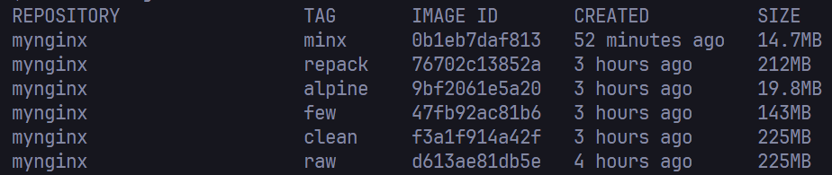

# IWNO9: Оптимизация образов контейнеровQ2  1

## Цель работы

Целью работы является знакомство с методами оптимизации образов.

## Задание

Сравнить различные методы оптимизации образов:

- Удаление неиспользуемых зависимостей и временных файлов
- Уменьшение количества слоев
- Минимальный базовый образ
- Перепаковка образа
- Использование всех методов 

## Выполнение работы

### Подготовка

Я создал репозиторий containers09 и подготовил необходимые файлы сайта в папке site. Затем создал исходный Dockerfile.raw:

```dockerfile
# create from ubuntu image
FROM ubuntu:latest

# update system
RUN apt-get update && apt-get upgrade -y

# install nginx
RUN apt-get install -y nginx

# copy site
COPY site /var/www/html

# expose port 80
EXPOSE 80

# run nginx
CMD ["nginx", "-g", "daemon off;"]
```

Собрал этот образ для дальнейшего сравнения:
```bash
docker image build -t mynginx:raw -f Dockerfile.raw .
```

---

### Метод 1: Удаление неиспользуемых зависимостей и временных файлов

Создал Dockerfile.clean с очисткой кэша пакетов и временных файлов:

```dockerfile
# create from ubuntu image
FROM ubuntu:latest

# update system
RUN apt-get update && apt-get upgrade -y

# install nginx
RUN apt-get install -y nginx

# remove apt cache
RUN apt-get clean && rm -rf /var/lib/apt/lists/* /tmp/* /var/tmp/*

# copy site
COPY site /var/www/html

# expose port 80
EXPOSE 80

# run nginx
CMD ["nginx", "-g", "daemon off;"]
```

**Преимущества метода:**
- Удаление кэша пакетов apt (`/var/lib/apt/lists/*`) освобождает значительное пространство, так как кэш содержит информацию обо всех доступных пакетах и их зависимостях
- Очистка временных файлов (`/tmp/`, `/var/tmp/*`) убирает артефакты, которые создаются при установке пакетов
- В результате мы получаем образ с только необходимыми для работы файлами, что уменьшает размер финального образа и повышает безопасность

> Однако так как это делается в рамках разных слоев, то в > итоге получается не самый оптимальный образ.
> Так как все слои занимают память.

> Из этого приходим к следующему методу оптимизации...

---

### Метод 2: Уменьшение количества слоев

Создал Dockerfile.few, объединив несколько команд в одну:

```dockerfile
# create from ubuntu image
FROM ubuntu:latest

# update system
RUN apt-get update && apt-get upgrade -y && \
    apt-get install -y nginx && \
    apt-get clean && rm -rf /var/lib/apt/lists/* /tmp/* /var/tmp/*

# copy site
COPY site /var/www/html

# expose port 80
EXPOSE 80

# run nginx
CMD ["nginx", "-g", "daemon off;"]
```

**Преимущества метода:**
- Каждый слой в Docker сохраняет свою метаинформацию и файловую систему, что создает дополнительные накладные расходы
- При объединении команд в одну инструкцию RUN создается только один слой вместо нескольких
- Промежуточные файлы (например, кэш apt после обновления системы) не сохраняются между слоями
- Уменьшается количество метаданных и улучшается производительность при извлечении образа

---

### Метод 3: Минимальный базовый образ

Создал Dockerfile.alpine, использующий Alpine Linux вместо Ubuntu:

```dockerfile
# create from alpine image
FROM alpine:latest

# update system
RUN apk update && apk upgrade

# install nginx
RUN apk add nginx

# copy site
COPY site /var/www/html

# expose port 80
EXPOSE 80

# run nginx
CMD ["nginx", "-g", "daemon off;"]
```

**Преимущества метода:**
- Alpine Linux - это очень компактный дистрибутив (~7MB), в отличие от Ubuntu (~80MB)
- Alpine использует musl libc вместо glibc и BusyBox для базовых утилит, что значительно уменьшает размер образа
- Меньше предустановленных пакетов и компонентов, что означает меньше потенциальных уязвимостей
- Пакетный менеджер apk эффективнее в плане потребления места, чем apt
- Результирующий образ загружается и запускается быстрее благодаря своему небольшому размеру

---

### Метод 4: Перепаковка образа

Выполнил перепаковку образа mynginx:raw в mynginx:repack:

```bash
docker container create --name mynginx mynginx:raw
docker container export mynginx | docker image import - mynginx:repack
docker container rm mynginx
```

**Преимущества метода:**
- При экспорте и импорте контейнера создается "плоский" образ без истории слоев
- Удаляются метаданные и промежуточные файлы, которые накапливаются в процессе создания образа
- Устраняются "мертвые" данные - файлы, которые были добавлены, а затем удалены в процессе создания образа
- Создается единый слой с файловой системой, что экономит место и улучшает эффективность использования дискового пространства
- Исключаются избыточные копии файлов, которые могут находиться в разных слоях

---

### Метод 5: Использование всех методов

Создал Dockerfile.min, применив все оптимизации одновременно:

```dockerfile
# create from alpine image
FROM alpine:latest

# update system, install nginx and clean
RUN apk update && apk upgrade && \
    apk add nginx && \
    rm -rf /var/cache/apk/*

# copy site
COPY site /var/www/html

# expose port 80
EXPOSE 80

# run nginx
CMD ["nginx", "-g", "daemon off;"]
```

---
Затем выполнил перепаковку финального образа:

```bash
docker image build -t mynginx:minx -f Dockerfile.min .
docker container create --name mynginx mynginx:minx
docker container export mynginx | docker image import - mynginx:min
docker container rm mynginx
```

**Преимущества метода:**
- Использование Alpine как базового образа значительно уменьшает начальный размер
- Объединение команд уменьшает количество слоев и промежуточных файлов
- Очистка кэша пакетов убирает ненужные данные
- Перепаковка удаляет историю слоев и создает оптимизированный одноуровневый образ
---

### Сравнение размеров образов

| Тег образа     | Размер |       Комментарий                       |
|----------------|--------|-----------------------------------------|
| mynginx:raw    | 225MB  | Исходный образ на Ubuntu                |
| mynginx:clean  | 225MB  | Образ с очисткой кэша и временных файлов|
| mynginx:few    | 143MB  | Образ с уменьшенным количеством слоев   |
| mynginx:alpine | 19.8MB | Образ на Alpine Linux                   |
| mynginx:repack | 212MB  | Перепакованный исходный образ           |
| mynginx:min    | 14.7MB | Образ со всеми методами оптимизации     |


---

## Ответы на вопросы

### Какой метод оптимизации образов вы считаете наиболее эффективным?

Я считаю, что использование минимального базового образа (Alpine Linux) является наиболее эффективным методом. Другие методы дают намного меньший эффект, хотя комбинация всех методов позволяет добиться еще лучших результатов.

### Почему очистка кэша пакетов в отдельном слое не уменьшает размер образа?

Очистка кэша пакетов в отдельном слое не уменьшает размер образа из-за особенностей работы слоев в Docker. Когда мы создаем новый слой с командой очистки, мы на самом деле не удаляем данные из предыдущих слоев, а только добавляем новый слой с информацией о том, что эти файлы удалены. Фактически, все данные из предыдущих слоев физически остаются внутри образа.

Размер образа определяется суммой размеров всех слоев, и хотя в итоговой файловой системе контейнера файлы будут отсутствовать, в самом образе они по-прежнему занимают место. Поэтому для эффективной очистки кэша необходимо выполнять её в том же слое (в той же инструкции RUN), где происходит установка пакетов.

### Что такое перепаковка образа?

Перепаковка образа - это процесс, при котором многослойный образ Docker преобразуется в одиночный "плоский" слой. Происходит это следующим образом:
1. Создается контейнер из исходного образа (но не запускается)
2. Контейнер экспортируется в tar-архив, который содержит только итоговую файловую систему без истории слоев
3. Tar-архив импортируется обратно как новый образ

В результате перепаковки:
- Устраняется история слоев и связанные с ней метаданные
- Удаляются "мертвые" файлы, которые были добавлены и затем удалены в процессе создания образа
- Оптимизируется использование дискового пространства, так как устраняется дублирование файлов между слоями
- Образ становится менее структурированным, но более компактным

## Выводы

В ходе выполнения лабораторной работы я изучил различные методы оптимизации Docker-образов и их эффективность. Наиболее значительное сокращение размера дает использование минимального базового образа, такого как Alpine Linux. Комбинирование этого подхода с другими методами (уменьшение количества слоев, очистка кэша и перепаковка) позволяет добиться максимальной оптимизации.

Оптимизация Docker-образов имеет множество преимуществ:
- Ускорение загрузки и развертывания контейнеров
- Экономия дискового пространства на хостах и в реестрах образов
- Уменьшение нагрузки на сеть при передаче образов
- Повышение безопасности за счет уменьшения поверхности атаки